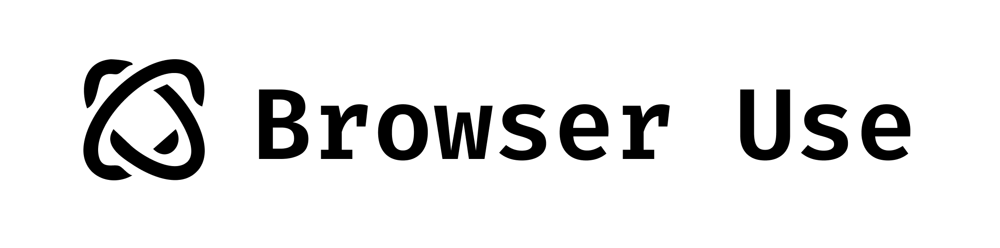

<picture>
  
</picture>

 

# Hi there, we are [Browser Use](https://browser-use.com)! 🌐

## 🔥 What do we do?

Magnus and Gregor, just two friends who love to code and build things. Our plan is to build the web agents of the future.

## ☁️ Want to use [hosted version?](https://cloud.browser-use.com)

We offer a fully hosted platform of Browser Use with browsers, llms, custom data retention, support and a lot more. Visit [cloud.browser-use.com](https://cloud.browser-use.com) to get started.

## 🤝 Contributions

We LOVE the community and contributions are always welcome!

Check our [open Browser Use issues](https://github.com/browser-use/browser-use/issues) and [open Browser Use pull requests](https://github.com/browser-use/browser-use/pulls) for more information.

If you see a bug in the docs, please report it at [Browser Use Docs](https://github.com/browser-use/docs/issues).

## 💬 Join the community

Don't want to miss out on our latest updates? Join our [Discord](https://link.browser-use.com/discord).
