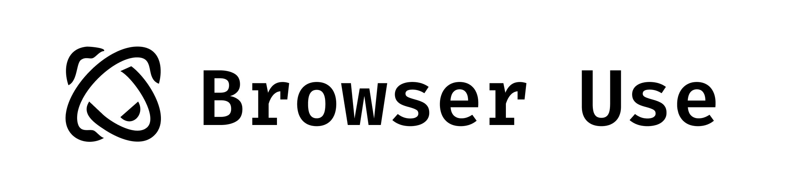

<picture>
  
</picture>

 

# Browser Use | Web Agents & Browser Infrastructure

Browser Use helps teams automate work on the web with open-source tools, fully hosted AI agents, and affordable, stealthy browser infrastructure.

## Hosted agents and browser infrastructure

- **[Browser Use Agents](https://browser-use.com/web-agents):** Fully hosted agents that turn natural-language instructions into completed browser tasks and structured data.
- **[Browser Infrastructure](https://browser-use.com/stealth-browsers):** Affordable stealth browsers with proxies and automatic CAPTCHA solving. Works with Playwright and Puppeteer.

**[Get started on Browser Use Cloud →](https://cloud.browser-use.com)**

## Contributions

Community contributions help improve Browser Use. Explore our [open issues](https://github.com/browser-use/browser-use/issues) and [pull requests](https://github.com/browser-use/browser-use/pulls) to get involved.

Report documentation bugs at [Browser Use Docs](https://github.com/browser-use/docs/issues).

## Community

Join our [Discord](https://link.browser-use.com/discord) to ask questions, share your work, and follow product updates.
